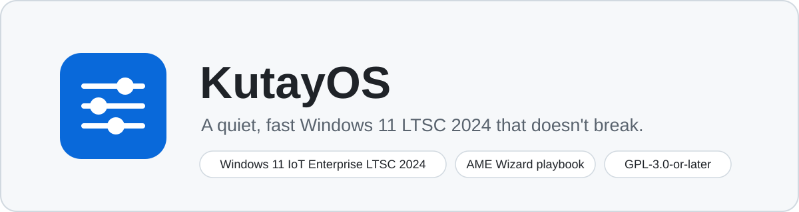
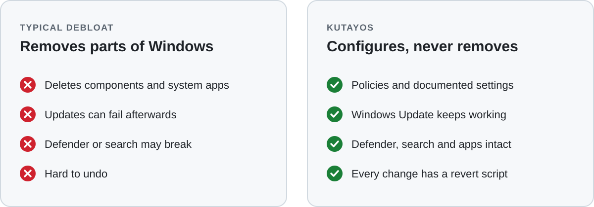
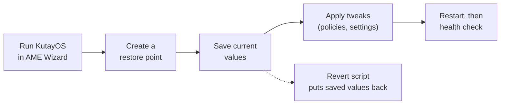

<p align="center">
  
</p>

> [!WARNING]
> **Preview (0.9.0).** It passed a full run in a virtual machine but has not been checked on real
> hardware yet. Try it on a PC you can reinstall.

## What is KutayOS?

KutayOS is a playbook for [AME Wizard](https://ameliorated.io/) that tunes
**Windows 11 IoT Enterprise LTSC 2024** (build 26100) for everyday use: less background noise,
no ads or suggestions, a tidy desktop and a smaller disk footprint.

The main rule: **it must not break Windows.** Updates, Defender, search, printing, audio and
your apps keep working, and every change can be undone.

## The approach

<p align="center">
  
</p>

- **Configure, don't remove.** KutayOS uses Group Policy registry keys and settings that
  Microsoft documents. It never deletes system files, components or core services.
- **Reversible.** A restore point is created and current values are saved before any change.
  Every tweak has a matching revert script.
- **Measured, not guessed.** A performance tweak is on by default only if a before/after
  measurement in a VM shows a real gain.
- **Readable.** Each tweak is one small YAML file with a source link and a note on how it was
  verified.
- **Written from scratch.** No code is copied from other playbooks.

## What it will do

| Goal | Meaning |
| --- | --- |
| **Fast** | Lower idle CPU, RAM and process count, quicker boot to desktop |
| **Clean** | Telemetry, ads, tips and suggestions off by policy |
| **Minimal** | A tidy Start menu, taskbar, Explorer and context menu |
| **Compact** | Less disk use with built-in Windows tools |

## What it never touches

- Windows Update, Microsoft Defender, search, WebView2 and app installs
- Secure Boot, TPM, driver signing and hypervisor settings
- Anti-cheat services, so games with Vanguard, FACEIT, Easy Anti-Cheat or BattlEye keep working
- The hosts file (blocking is done with policies and firewall rules instead)

Anything with a known side effect is off by default and comes with a plain warning.

## How it works



## Install

Install Windows 11 IoT Enterprise LTSC 2024, update it, then run the KutayOS `.apbx` in AME Wizard.
The [install guide](docs/install.md) walks through the USB stick (Rufus), the AME Wizard run, the
health check afterwards and how to undo everything.

## Roadmap

| Step | Scope | Status |
| --- | --- | --- |
| 0. Groundwork | Build script, test VM, measurement tools | Done |
| 1. Safety net | Restore point, value snapshots, revert scripts | Done |
| 2. Clean | Telemetry, ads and suggestion policies | Done |
| 3. Minimal shell | Start, taskbar, Explorer defaults, user options | Done |
| 4. Compact | Component cleanup, CompactOS, optional hibernation | Done |
| 5. Performance | Measured tweaks only | Done |
| 6. Release | Health check, `.apbx` package, full VM test | 0.9.0 done; 1.0.0 after real-hardware checks |
| v2. Toolbox | Desktop app for toggles, rollback and drift after updates | Later |

Details are in the [product requirements](docs/PRD.md).

## Build from source

Requirements: Windows PowerShell 5.1 and [7-Zip](https://www.7-zip.org/).

```powershell
powershell -NoProfile -ExecutionPolicy Bypass -File tools/build.ps1
```

The package is written to `dist/KutayOS-<version>.apbx`. Tests use
[Pester 5](https://pester.dev/):

```powershell
Invoke-Pester tests
```

## Project layout

```text
src/playbook/        AME Wizard playbook (playbook.conf, tweaks, scripts)
src/toolbox/         v2 desktop Toolbox (planned)
tools/               build script and test VM helpers
docs/                requirements, research notes, measurements
tests/               Pester tests
```

## License

[GPL-3.0-or-later](LICENSE). KutayOS is not affiliated with Microsoft or Ameliorated.
