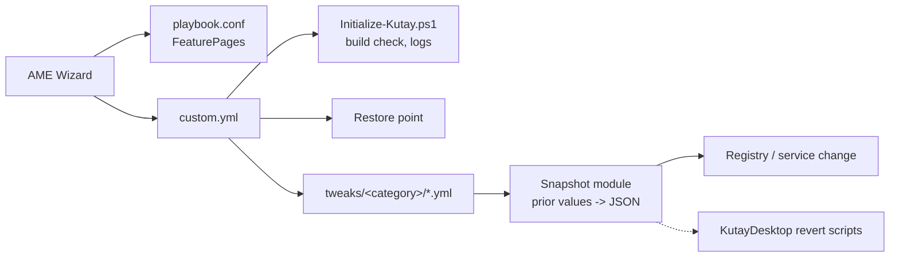

# KutayOS PRD (v1: Playbook)

## Problem

Stock Windows 11 LTSC 2024 still ships telemetry, background services and defaults that add
latency and noise. Existing playbooks (AtlasOS, ReviOS) are broad, hard to audit per change, and
some defaults break anti-cheat or security. KutayOS wants a small, auditable playbook where every
change is justified, reversible and safe for competitive games.

## Users

- Primary: the author (competitive gaming + development on one machine).
- Secondary: technical users who want to read every change before applying it.

## Goals

1. Every tweak is one YAML file with a source link, an evidence level and a revert script.
2. A restore point and a JSON snapshot of prior values exist before any change.
3. Vanguard, FACEIT, EAC and BattlEye keep working with the default options.
4. Performance/latency tweaks are enabled by default only with `measured` evidence.

## Non-goals (v1)

- Other Windows editions or builds than LTSC 2024 build 26100.
- A GUI beyond AME Wizard FeaturePages (the C# Toolbox is v2).
- Driver installs, hosts-file blocking, Secure Boot / TPM / DSE / hypervisor changes.

## Architecture

Shared helpers live in `Executables/KutayModules` and are copied to `%windir%\KutayOS`.
Snapshots and logs go to `%windir%\KutayOS\State` and `%windir%\KutayOS\Logs`.

## Slices

Each slice: Pester tests first, implementation, one review, VM smoke test on snapshot `clean`, commit.

1. **Safety net**: restore point step (enable protection, frequency override with snapshot,
   before/after sequence check, halt on failure) + snapshot module (read prior registry/service
   state, write JSON, idempotent) + one privacy tweak (`AllowTelemetry` policy / DiagTrack) +
   matching revert script.
2. **Privacy set**: remaining telemetry/advertising/activity policies, documented evidence.
3. **FeaturePages**: first user options (e.g. Defender stays / disable, VBS/HVCI opt-in with warning).
4. **Developer setup**: winget bootstrap, VCRedist, DirectX runtime.
5. **Performance (measured)**: LatencyMon/xperf baseline in the VM, then tweaks one by one.
6. **Release**: build `.apbx` with 7-Zip, full VM run, revert-all test, README.

## Success criteria for v1

- Full playbook run on a clean VM finishes with exit code 0 and a restore point.
- Revert-all brings every snapshotted value back (checked by a script diffing the JSON).
- Valorant (Vanguard) and one EAC game launch after the run.

## Open questions

- Actual `Checkpoint-Computer` behavior on the 24h limit and under TrustedInstaller (verify in VM).
- `!cmd` properties and option negation in AME (see `docs/research/ame-actions.md`).
