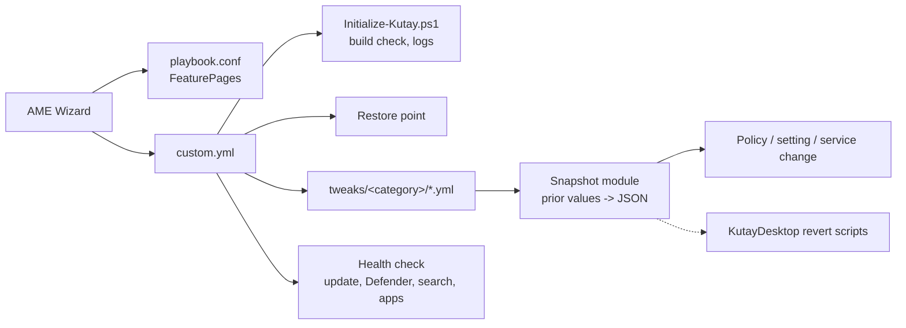

# KutayOS PRD (v1: Playbook)

## Problem

Stock Windows 11 LTSC 2024 is already lean, but it still ships telemetry, suggestions, background
tasks and defaults that cost resources and add noise. Popular "debloat" projects (AtlasOS, ReviOS,
tiny11) go further by removing components, stripping the image or disabling core services. That
sometimes breaks Windows: cumulative updates fail, Defender or search stops working, apps that
depend on WebView2 or AppX deployment fail, and fixing it later is hard.

KutayOS makes Windows fast, clean, minimal and compact **without breaking it**: every change uses
a supported setting, can be reverted, and leaves Windows able to update and run everyday software.

## Users

- General users who want a quiet, responsive, tidy Windows and do not want to troubleshoot it
  afterwards. Not a gaming-only or enthusiast-only build.
- Technical users who want to read every change before applying it.

## Principles

1. **Don't break Windows.** Configure, don't amputate. KutayOS never deletes system files,
   removes servicing packages/components, or disables services that updates, security, search,
   networking, printing, audio or app installs depend on. Anything with a known side effect is an
   opt-in option with a plain-language warning.
2. **Supported mechanisms first.** Policies (the registry keys behind Group Policy), documented
   settings, scheduled-task and service start-type changes where Microsoft documents them as safe.
   Microsoft documentation is the primary source for every tweak.
3. **Reversible.** A restore point and a snapshot of prior values exist before any change; every
   tweak has a revert script.
4. **Evidence over folklore.** A performance tweak is on by default only when a before/after
   measurement shows a gain. Folklore tweaks (for example large registry "latency" packs) are left
   out.
5. **Own code.** KutayOS is written from scratch. Other playbooks may be read to learn which
   settings exist, but their code is not copied; each setting is re-derived from primary docs.

## Goals

1. Performance: lower idle CPU, RAM and process count, faster boot to desktop, responsive UI.
2. Clean: telemetry, advertising, suggestions, tips and consumer content turned off via policy.
3. Minimal: a tidy shell (Start, taskbar, Explorer, context menu) with nothing pushed at the user.
4. Compact: smaller disk footprint using supported tools (component store cleanup, CompactOS,
   optional hibernation/reserved storage settings).
5. Safe: Windows Update, Defender, search, Microsoft Store/AppX deployment (where present),
   WebView2 and anti-cheat protected games (Vanguard, FACEIT, EAC, BattlEye) keep working.
6. Auditable: every tweak is one YAML file with a source link, an evidence level and a revert
   script.

## Non-goals (v1)

- Other Windows editions or builds than LTSC 2024 build 26100.
- Modified ISOs or image stripping (the tiny11 approach).
- Removing Windows components, Defender, Windows Update, Edge WebView2 or the servicing stack.
- A GUI beyond AME Wizard FeaturePages (the C# Toolbox is v2).
- Driver installs, hosts-file blocking, Secure Boot / TPM / DSE / hypervisor changes.
- Gaming-specific latency tuning as a product focus.

## Architecture

Shared helpers live in `Executables/KutayModules` and are copied to `%windir%\KutayOS`.
Snapshots and logs go to `%windir%\KutayOS\State` and `%windir%\KutayOS\Logs`.

## Update strategy

- LTSC gets no feature updates: it stays on build 26100 and only receives cumulative updates,
  so the playbook targets one build for the life of LTSC 2024.
- Cumulative updates can occasionally reset a setting. Tweaks therefore use policies first
  (principle 2), which Windows servicing is least likely to overwrite.
- The v2 Toolbox checks for drift: it compares the applied tweaks with the current values, shows
  what changed after an update and re-applies with one click.
- A new LTSC release (new build number) means a new KutayOS version: add the build to
  `SupportedBuilds`, re-test every tweak in the VM.
- No scheduled monthly re-test routine; drift is caught by the Toolbox and by the next VM run.

## Slices

Each slice: Pester tests first, implementation, one review, VM smoke test on snapshot `clean`, commit.

1. **Safety net**: restore point step (enable protection, frequency override with snapshot,
   before/after sequence check, halt on failure) + snapshot module (read prior registry/service
   state, write JSON, idempotent) + one privacy tweak (`AllowTelemetry` policy) + matching revert
   script.
2. **Clean**: remaining telemetry, advertising, suggestion and consumer-content policies.
3. **Minimal shell**: Start, taskbar, Explorer and context-menu defaults; FeaturePages for the
   choices people disagree on.
4. **Compact**: component store cleanup, CompactOS, hibernation / reserved storage as options,
   with measured disk savings.
5. **Performance (measured)**: VM baseline (boot time, idle CPU/RAM, process count), then
   scheduled tasks, startup and background settings one by one; keep only measured gains.
6. **Health check + release**: post-run check script (update scan, Defender status, search,
   WebView2), build `.apbx`, full VM run, revert-all test, README.

Developer setup (winget, runtimes) and the C# Toolbox move to v2.

## Success criteria for v1

- Full playbook run on a clean VM finishes with exit code 0 and a restore point.
- After the run: the latest cumulative update installs, Defender reports healthy, search returns
  results, and a WebView2 app opens.
- Revert-all brings every snapshotted value back (checked by a script diffing the JSON).
- Measured on the VM against the clean snapshot: fewer idle processes, lower idle RAM, smaller
  used disk space. The numbers are recorded in `docs/measurements/`.
- One anti-cheat protected game launches after the run.

## Open questions

- Actual `Checkpoint-Computer` behavior on the 24h limit and under TrustedInstaller (verify in VM).
- `!cmd` properties and option negation in AME (see `docs/research/ame-actions.md`).
- ~~Which consumer features LTSC 2024 actually ships.~~ Answered by `tools/vm/guest-inventory.ps1`:
  no Store, Widgets, Copilot, OneDrive or Xbox apps; Recall payload removed; only Edge and
  SecHealthUI provisioned. Advertising ID, tailored experiences, inking/typing collection, CEIP
  tasks and DiagTrack are on by default.
- ~~Which disk space settings apply to LTSC 2024.~~ Checked in the VM (Slice 4): Windows setup
  turns Compact OS on by itself on a small disk (64 GB), reserved storage is only on where its
  policy passes, and hibernation needs firmware support the VM lacks.
- winget, App Installer and Microsoft Store are absent on a clean LTSC 2024 install (checked in
  the VM on 2026-09-27). App installs need another path.
